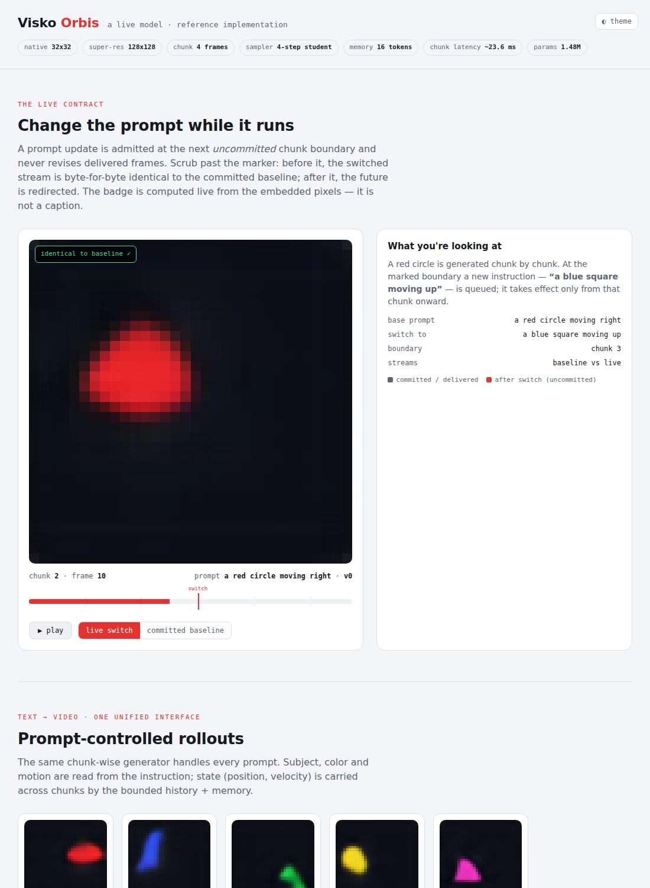

# Visko Orbis — reference implementation

A faithful reference implementation of the *Live Model* from
[**Visko Orbis 1.0: A Live Model for Real-Time Interactive Long Video
Generation**](https://arxiv.org/pdf/2607.26694).

**Development and deployment target Linux + NVIDIA GPU** (Docker locally; **RunPod**
and **Vast.ai** in the cloud). Primary GPUs: **RTX 4090**, **RTX 5090**, **H100**
(CUDA 12.8 / PyTorch cu128). See [`deploy/README.md`](deploy/README.md).

The production system generates native 832×480 video, streams it to 4K at 24 FPS
across a multi-GPU serving engine, and is trained on a large curated video
corpus. That cannot be reproduced without the weights, the data, and a GPU
cluster. **What can be reproduced — and is, here — is the paper's actual
contribution: the *mechanisms* of a Live Model.** Every core idea is implemented
as a real, trainable, testable component at a toy scale that runs end-to-end in
minutes on a single GPU (or CPU fallback for unit tests).

📄 **A full write-up of the derivation, the math, and the paper→code mapping is in
[`doc/METHODOLOGY.md`](doc/METHODOLOGY.md)** (the source paper is archived under
`doc/references/`).

To make text→video alignment and mid-rollout prompt switching *visible* rather
than a matter of faith, the model is grounded in a small prompt-controlled world:
a colored shape moving in a direction. The instruction determines the subject,
attribute and motion; the rollout carries state (position, velocity) across
chunks; switching the prompt mid-stream visibly redirects the *future* while the
already-delivered past is immutable.

<p align="center"><em>Change the prompt while it runs — the delivered past never changes.</em></p>


The interactive console (`orbis demo`, a single self-contained HTML file):



---

## What maps to what

| Paper mechanism | Where it lives | What it does here |
|---|---|---|
| Unified live-video formulation `p_θ(z_k \| H_k, c_k, r_k)` | `orbis/model.py` | Chunk-wise DiT predicting a rectified-flow velocity for the current latent chunk, conditioned on history, instruction, reference and memory. |
| Rectified-flow objective (Eq. 1) | `orbis/flow.py` | `z_σ=(1−σ)z+σε`, target `ε−z`, Euler sampler. |
| Bounded multi-scale memory | `orbis/memory.py` | Recency window at native granularity + a **fixed-capacity** persistent state updated by gated cross-attention; cost independent of rollout length. |
| Progressive training (Fig. 3) | `orbis/train.py` | VAE → bidirectional short-clip prior → streaming adaptation with history augmentation. |
| Few-step distillation | `orbis/distill.py` | A frozen many-step teacher supervises a few-step student for the real-time path. |
| Live control: versioned prompt switching | `orbis/session.py` | Updates admitted at the next **uncommitted** chunk boundary; delivered frames never revised; rolling prompt summary preserves established entities. |
| Delivered-video runtime | `orbis/engine.py` | Streaming loop, T2V/I2V/V2V, progressive per-chunk delivery, versioned state reuse. |
| Streaming super-resolution | `orbis/superres.py` | Reference-aware, within-chunk (no cross-chunk autoregression) refinement. |
| Latent video model | `orbis/vae.py` | Small convolutional latent autoencoder. |
| Multilingual prompting | `orbis/text.py`, `orbis/vocab.py` | Synonyms in several languages collapse to canonical tokens. |
| Event-based evaluation | `orbis/eval.py` | Whole-rollout metrics: prompt alignment, temporal stability, switch compliance, long-horizon drift. |

---

## Quickstart (Docker + GPU)

Requires [Docker](https://docs.docker.com/) with the
[NVIDIA Container Toolkit](https://docs.nvidia.com/datacenter/cloud-native/container-toolkit/latest/install-guide.html).

```bash
docker compose build
docker compose run --rm orbis bash

# inside the container (CUDA torch from the cu128 lockfile):
uv run python scripts/train_all.py orbis.pt        # full train on GPU
uv run python scripts/train_all.py orbis.pt 0.1    # smoke checkpoint

uv run orbis generate --prompt "a red circle moving right" --chunks 6 --out out.gif
uv run orbis live --prompt "a red circle moving right" \
           --switch "3:a blue square moving up" --chunks 8 --out live.gif
uv run orbis generate --prompt "a cyan square moving right" --mode i2v --out i2v.gif
uv run orbis generate --prompt "a red circle moving right" --superres --out hi.gif
uv run orbis eval
uv run orbis demo --out demo.html
```

One-shot without a shell:

```bash
docker compose run --rm orbis uv run pytest
docker compose run --rm orbis uv run python scripts/train_all.py orbis.pt 0.1
```

Cloud: push the image and use the RunPod / Vast templates under [`deploy/`](deploy/).

## The live contract, precisely

A session is a persistent process. Calling `session.set_prompt(text)` **queues** a
versioned update; it is admitted by `admit_pending()` at the start of the next
chunk. Because a chunk is committed atomically after it is generated:

* frames from chunks generated before the switch are byte-for-byte unchanged;
* the switch takes effect from the boundary chunk onward.

This is verified by a training-independent test
(`tests/test_session_engine.py::test_switch_only_affects_uncommitted_chunks`) and
demonstrated in the HTML console, where a live badge compares the switched stream
against the committed baseline *pixel by pixel*.

The **rolling prompt summary** means a partial update keeps the rest of the scene:
after "a red triangle moving right", the update "moving up" yields a red triangle
moving up — only the named attribute changes.

## How a chunk is generated

```
noise ─▶ few-step rectified-flow student ─▶ decode ─▶ super-res ─▶ deliver
              ▲     ▲       ▲       ▲
            c_k   r_k     H_k     M_k        (instruction / reference / history / memory)
```

Context that is constant across the solver steps of one chunk (memory, reference,
history, text) is encoded once into a `ModelContext` and reused — the toy analogue
of the paper's versioned state reuse. After a chunk is committed, frames leaving
the recency window are consolidated into the fixed-capacity memory, so per-chunk
cost does not grow with rollout length.

## Architecture notes

* **Latent space.** Frames (32×32×3) are encoded to an 8×8×8 latent by a small
  conv autoencoder trained with a foreground-weighted reconstruction loss (plain
  MSE mean-collapses onto the dark background).
* **Generator.** A DiT with timestep-AdaLN, text cross-attention, and a token
  sequence `[memory | reference | history | chunk]`. Full attention within the
  assembled sequence; causality *across* chunks is enforced by the rollout (a
  chunk only ever sees past history). Patch size 2 over the latent grid.
* **Bounded memory** is two-scale (native recency window + one compressed
  persistent state). In this low-dimensional toy world the recency window already
  captures most of the state, so memory's long-horizon benefit is primarily
  *architectural*: it is faithfully implemented, trained jointly, and kept
  strictly bounded — the property that matters for hour-scale generation.

## Tests

```bash
docker compose run --rm orbis uv run pytest
# ~20 fast tests; the trained-model test runs if orbis.pt exists
```

Covered: world determinism and prompt switching; multilingual parsing and the
rolling summary; PNG/GIF encoders; patchify round-trip; rectified-flow endpoints
and a closed-form sampler check; generator shapes and context-reuse equivalence;
**bounded** memory and streaming state; the prompt-versioning contract; T2V/I2V/V2V
runs; super-resolution upscaling; checkpoint round-trip.

## Honest scope

This is a *reference implementation of the mechanisms*, not the trained Orbis
model. It shares no weights or data with the paper; numbers here are on the toy
benchmark and are not comparable to the paper's results. The value is a compact,
readable, end-to-end system where each idea in the paper is a component you can
read, run, test, and modify.

## Layout

```
orbis/                 Python package (CUDA-first via device.py)
scripts/train_all.py
tests/   assets/   doc/
Dockerfile   docker-compose.yml
deploy/                RunPod + Vast templates
.cursor/rules/         Linux+GPU project rule
```
